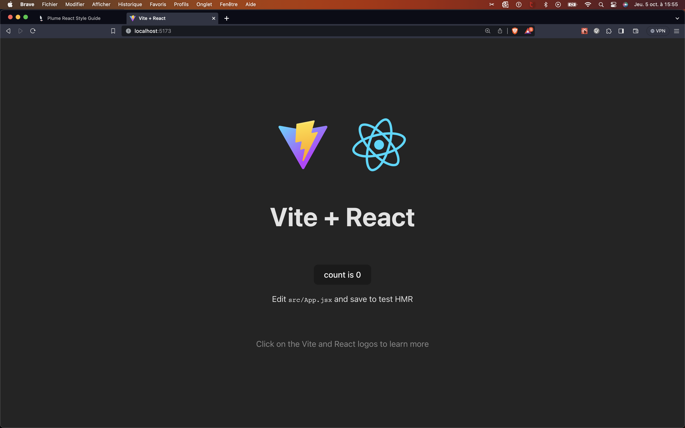
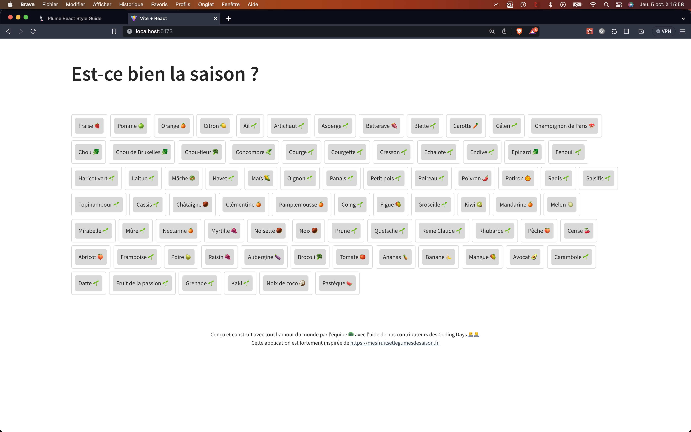
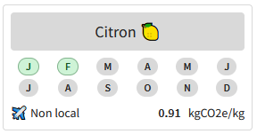
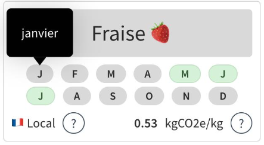
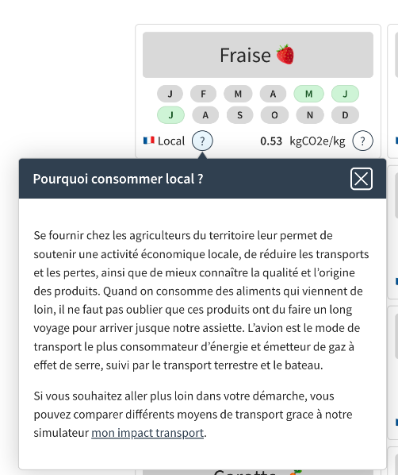
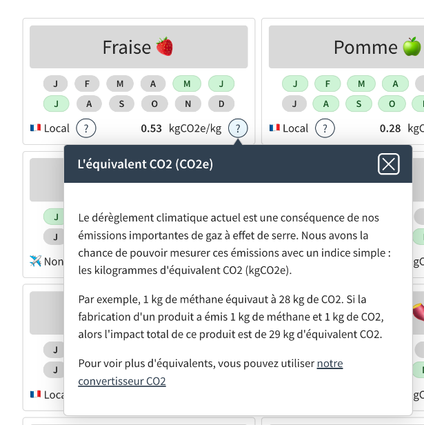
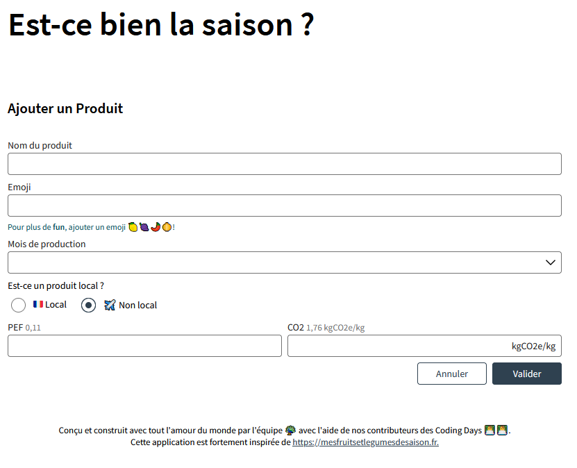
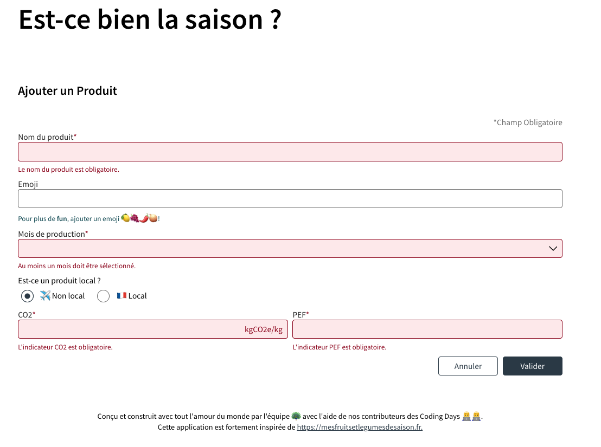
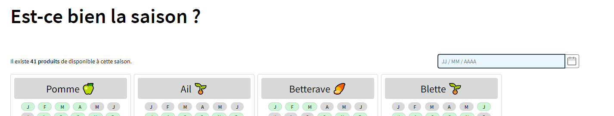

# Travaux pratiques `Plume React`

Pour démarrer les travaux pratiques, clonez le projet `plume-react-vegetables-seasons` :

```terminal
git clone git@github.maif.io:commons/plume-react-vegetables-seasons.git
```

L'étape 0 initialise un projet ViteJS. Cette étape est de la configuration d'outils. Elle n'est pas obligatoire pour la suite des travaux.

Un temps d'échange de ⏱️ ~15/20min est prévu entre chaque étape pour présenter une solution et l'étape suivante.

## Étape 0, <small>⏱️ ~10min</small>

L’objectif de l'étape 0 est d’initialiser un projet React et la boîte à outils ViteJS.



- [ ] Créez un projet avec vite.js.
  - https://vitejs.dev
  - https://vitejs.dev/guide/#scaffolding-your-first-vite-project
- [ ] Initialisez le système de versioning Git pour pouvoir travailler sur plusieurs branches.
  - `git init`
  - `Git checkout -b mon-tp`
- [ ] Lancez l’application par défaut
  - `npm install`
  - `npm run dev`
  - Ouvrez votre navigateur à l’adresse http://localhost:5173/

> ℹ️ le port peut varier dans certains cas 😉.

> ℹ️ L'import du package `plume-react` dans le package.json est à réaliser dans l'étape 1, ici, il faut juste se concentrer sur l'initialisation d'un projet ViteJs React par défaut.

## Étape 1, <small>⏱️ _~35/40 min_</small>

L’objectif du Step 1 est d’initier une page d’accueil simple. Les composants Plume `Mediacard` et le _display_ `flex` seront de la partie.




> ℹ️ Si vous avez sauté l'étape 0 ou si vous voulez partir sur une base saine, tirez la branche `step-0` :
>
> ```terminal
> git checkout step-0
> ```

- [ ] Supprimez le code initié par ViteJS.

- [ ] Ajoutez les dépendances `plume-react` et `sass`.
  - Pensez à renommer le fichier `App.css` en `App.scss`.

> ℹ️ `npm install plume-react; npm install sass --save-dev;`

> en cas de soucis de configuration : `npm config set registry http://nexus-fabfonc.maif.local/repository/npm-public/``

- [ ] Initiez un layout de base avec une balise `header`, `main` et `footer`.
  - Ajoutez un titre principal « Est-ce bien la saison ? »
  - Pour le footer, ajoutez un message plein d’Amour

> ℹ️ Pour rappel la meilleure des sémantiques pour l’accessibilité est d’utiliser les balises HTML de base. Les attributs wai-aria sont à utiliser que lorsque nous sommes limités avec les balises HTML.

- [ ] Maintenant, passons aux choses sérieuses avec le conteneur principal `main`

  - Téléchargez et ajoutez dans votre projet le fichier products.json https://github.maif.io/commons/plume-react-vegetables-seasons/raw/step-1/src/assets/products.json
  - Importez le fichier dans votre App.jsx et affectez ces produits à une constante
  - Affichez le nom et l’emoji des produits en utilisant le composant MediaCard https://pages.github.maif.io/commons/plume-react/#/Layout/MediaCard

- [ ] Mettons un peu de peinture là-dedans en utilisant le type d’affichage Flexbox : https://css-tricks.com/snippets/css/a-guide-to-flexbox/

- [ ] Importez le thème `@import "~plume-react/dist/style/theme-maif-dsi"`;

> 🚨 Attention
>
> ```terminal
> [plugin:vite:css] [sass] Can't find stylesheet to import.
> ```
>
> Une petite config ViteJS nécessaire
>
> ```javascript
> import { defineConfig } from 'vite'
> import react from '@vitejs/plugin-react'
> import { join } from 'path'
>
> // https://vitejs.dev/config/
> export default defineConfig({
> 	plugins: [react()],
> 	resolve: {
> 		alias: [
> 			{
> 				find: /~(.+)/,
> 				replacement: join(globalThis.process.cwd(), 'node_modules/$1'),
> 			},
> 		],
> 	},
> })
> ```

### Pour aller plus loin…

- [ ] Importez le thème utilities plume-react `@import '~plume-react/dist/style/theme-utilities'`;

- [ ] Jouez avec les variables provenant du thème plume, par exemple, à l’aide des mixin `clr(primary)` ou `spc(m)`...

- [ ] Rendez votre page d’accueil responsive
  - Créez une map scss
    ```css
    $grid-breakpoints: (
    	xs: 0,
    	sm: 576px,
    	md: 768px,
    	lg: 992px,
    	xl: 1200px,
    	xxl: 1400px
    );
    ```
  - Jouez avec les _media rules_, par exemple changez les espacements en fonction de la largeur d'écran.

## Étape 2, <small>⏱️ _~35/40 min_</small>

L’objectif de l'étape 2 est d’améliorer le contenu de composant `MediaCard` : Javascript comme un expert, API Date et composant `Badge`.



> ℹ️ Pour partir sur de bonnes bases, n'hésitez pas à récupérer la branche `step-1` :
>
> ```terminal
> git checkout step-1
> ```

- [ ] Créez un tableau javascript ['J', 'F', 'M', 'A', 'M', 'J', 'J', 'A', 'S', 'O', 'N', 'D']
- [ ] Affichez les mois ou le produit est disponible, utilisez le composant `Badge`` : https://pages.github.maif.io/commons/plume-react/#/Badge/Badge
- [ ] Le produit est-il local ?
- [ ] Mise en avant kgCO2e/kg
- [ ] N’oubliez pas d’utiliser les variables et Mixin SCSS de Plume 😝
- [ ] Grid, grid-template...
- [ ] Pensez à utiliser le Nullish coalescing operator (??) lorsque l’information n’est pas présente dans votre DataSource https://developer.mozilla.org/en-US/docs/Web/JavaScript/Reference/Operators/Nullish_coalescing

### Pour aller plus loin…

Le but est de générer le tableau de façon automatique et de profiter de l'internationalisation de la fonction `toLocaleTimeString()` de l'API Date intégrée directement au langage Javascript.

- [ ] Générez le tableau à l’aide de l’API Date de javascript :p
  - https://stackoverflow.com/questions/3895478/does-javascript-have-a-method-like-range-to-generate-a-range-within-the-supp
  - https://developer.mozilla.org/fr/docs/Web/JavaScript/Reference/Global_Objects/Date
  - https://developer.mozilla.org/fr/docs/Web/JavaScript/Reference/Global_Objects/Date/toLocaleTimeString
  - https://developer.mozilla.org/en-US/docs/Web/JavaScript/Reference/Global_Objects/Intl/DateTimeFormat/DateTimeFormat#options (month style :p)

## Étape 3, <small>⏱️ _~40/45 min_</small>

L’objectif de l'étape 3 est d'intégrer 2 autres composants : `Tooltip` et `AnchorDialog`.

> ℹ️ Pour partir sur de bonne base, n'hésitez pas à récupérer la branche `step-2` :
>
> ```terminal
> git checkout step-2
> ```

- [ ] Ajoutez un `Tooltip` au `Badge` contenant l'initiale du mois afin d'afficher le mois complet.

> 🔗 https://pages.github.maif.io/commons/plume-react/#/Tooltips/Tooltip



- [ ] Ajoutez un bouton (?) à droite du libellé Local et lui associer une `AnchorDialog`. Un clic sur ce bouton doit afficher l'`AnchorDialog`` avec les caractéristiques suivantes :

  - Titre : _Pourquoi consommer local ?_
  - Contenu : _Se fournir chez les agriculteurs du territoire leur permet de soutenir une activité économique
    locale, de réduire les transports et les pertes, ainsi que de mieux connaître la qualité et
    l’origine des produits. Quand on consomme des aliments qui viennent de loin, il ne faut pas oublier
    que ces produits ont dû faire un long voyage pour arriver jusqu'à notre assiette. L’avion est le mode
    de transport le plus consommateur d’énergie et émetteur de gaz à effet de serre, suivi par le
    transport terrestre et le bateau._

> 🔗 https://pages.github.maif.io/commons/plume-react/#/Dialogs/AnchorDialog



### Pour aller plus loin…

- [ ] Ajoutez un bouton (?) à droite du libellé **kgCO2e/kg** et lui associer une `AnchorDialog`. Un clic sur ce bouton doit afficher l'`AnchorDialog` avec les caractéristiques suivantes :

  - Titre : _L'équivalent CO2 (CO2e)_
  - Contenu : _Se fournir chez les agriculteurs du territoire leur permet de soutenir une activité économique
    locale, de réduire les transports et les pertes, ainsi que de mieux connaître la qualité et
    l’origine des produits. Quand on consomme des aliments qui viennent de loin, il ne faut pas oublier
    que ces produits ont dû faire un long voyage pour arriver jusqu'à notre assiette. L’avion est le mode
    de transport le plus consommateur d’énergie et émetteur de gaz à effet de serre, suivi par le
    transport terrestre et le bateau. Si vous souhaitez aller plus loin dans votre démarche, vous pouvez comparer différents moyens de transport grâce à notre simulateur <a href="https://impactco2.fr/transport" target="_blank" rel="noreferrer">mon impact transport</a>._



## Étape 4, <small>⏱️ _~40/45 min_</small>

L’objectif de l'étape 4 est de créer un formulaire d'ajout de produit à l'aide des différents composants moléculaires formElement.

> ℹ️ Pour partir sur de bonnes bases, n'hésitez pas à récupérer la branche `step-3` :
>
> ```terminal
> git checkout step-3
> ```

Sur cette branche, le composant `ProductCards` a été externalisé et un bouton "Ajouter un produit" a été ajouté en haut de page.
Ce bouton permettra de switcher entre le tableau de produits et le formulaire. Nous simulerons ainsi un changement de page entre le mode "tableau de produits" et le mode "ajout de produit".



- [ ] Créez un composant `ProductForm` qui va contenir le formulaire.

> 🔗 Pour créer le formulaire, vous aurez besoin des composants suivants :
>
> - `Form` : https://pages.github.maif.io/commons/plume-react/#/Forms/Form
> - `StringFormFragment` : https://pages.github.maif.io/commons/plume-react/#/Forms/Form%20Fragments/StringFormFragment
> - `ComboboxFormFragment` (en mode sélection multiple) : https://pages.github.maif.io/commons/plume-react/#/Forms/Form%20Fragments/ComboBoxFormFragment
> - `RadioGroupFormFragment` : https://pages.github.maif.io/commons/plume-react/#/Forms/Fieldset%20Form%20Fragments/RadioGroupFormFragment
> - `NumberFormFragment` : https://pages.github.maif.io/commons/plume-react/#/Forms/Form%20Fragments/NumberFormFragment

> 🎨 Pour la disposition des champs pensez à utiliser les flexbox 😉

- [ ] Ajoutez les deux boutons "Annuler et "Valider" en bas du formulaire.

  - Le bouton "Annuler" doit permettre de revenir vers le mode "tableau de produits".
  - Le bouton "Valider" doit ajouter le produit aux produits existants et revernir sur la vue "Liste des produits".

- [ ] Affichez une notification afin d'indiquer que le produit a bien été créé.
  > - `Notification` : https://pages.github.maif.io/commons/plume-react/#/Contextes/Notifications/Notifications%20globales
  - Les paramètres de la notification sont les suivants :
     - la notification est de type SUCCES
     - elle doit s'afficher et disparaitre au bout de 5 secondes
     - Le contenu de la notification doit être : Le produit (nom_du_produit_saisi_sur_formulaire) a été créé !
								
> ℹ️ Lorsqu'une notification est affichée, le contenu de celle-ci doit être poussé dans la Zone live afin que ce contenu puisse être lu par les les technologies d'assistances. Si vous utilisez le provider Notification, il est impératif d'utiliser le provider `A11yProvider`en tant que provider "parent" du provider Notification afin que votre application répondent aux exigences de l'accessibilité. Documentatiion ici : https://pages.github.maif.io/commons/plume-react/#/Contextes/a11y%20R%C3%A9gion%20Live
  
  

### Pour aller plus loin…

- [ ] Personnalisez le `ComboboxFormFragment` en ajoutant un emoji devant chaque nom de mois.

## Étape 5, <small>⏱️ _~30 min_</small>

L'intégration d'un formulaire s'accompagne toujours d'une validation. C'est ce que nous allons faire dans cette étape 5 à l'aide du hook `useValidatedState`.

> ℹ️ Pour partir sur de bonnes bases, n'hésitez pas à récupérer la branche `step-4` :
>
> ```terminal
> git checkout step-4
> ```



> ℹ️ Le fait d'utiliser un hook de validation a plusieurs avantages :
>
> - Simplifier la mise en place de validation sur un state complexe
> - Découpler la validation métier de la partie comportement/scripting HTML
> - Déclencher la validation à n'importe quel endroit dans la vie du composant

- [ ] importez le hook `useValidatedState` et remplacez le hook `useState` par celui-ci

> ℹ️ En plus de retourner le `state` et la méthode `setState` classiques, le hook retourne un objet `errors` et une callback de validation `validate`.
>
> L'objet `errors` est l'image de l'object `state` mais chaque valeur de clé peut retourner un message (ie chaîne de caractères). Ce dernier est construit à chaque fois que la méthode `validate` est déclenchée.
>
> La méthode `validate` prend en paramètre un objet de callback. Cet objet de callback doit être à l'image de l'objet `state`. La méthode `validate` retourne un objet de type :
>
> ```javascript
> {
>    errors,
>    isFailure: () => isDefined(errors),
>    isSuccess: () => nonDefined(errors),
>    throwErrorIfFail: message => {
>        if (isDefined(errors)) {
>            throw new Error(message);
>        }
>    }
> }
> ```

> ℹ️ Par exemple, prenons le `state` suivant :
>
> ```javascript
> {
> 	societaire: {
> 		prenom: undefined
> 		age: 42
> 	}
> }
> ```
>
> l'appel de la méthode `validate` serait :
>
> ```javascript
> validate({
> 	societaire: {
> 		prenom: (it) => {
> 			if ([undefined, null].includes(it.prenom))
> 				return `Le prénom du sociétaire est obligatoire.`
> 		},
> 	},
> })
> ```
>
> retournera le pseudo objet suivant :
>
> ```javascript
> {
>    errors: {
>        societaire: {
>            prenom: `Le prénom du produit est obligatoire.`
>        }
>    },
>    isFailure: () => true,
>    isSuccess: () => false,
>    throwErrorIfFail: (message) => throw new Error(message)
> }
> ```

> ℹ️ Pour information, le message levé par la méthode `throwErrorIfFail` est capturé par le composant `Form` de Plume et interprété comme un message général.

- [ ] Ajoutez la notion de `mandatory`sur les fragments du formulaire suivant :

  - Nom du produit
  - Mois de production
  - PEF
  - CO2

- [ ] Déclenchez une validation à la soumission du formulaire avec les règles suivantes :

  - Le nom du produit est obligatoire.
  - Au moins un mois doit être sélectionné.
  - L'indicateur PEF est obligatoire.
  - Un PEF doit être compris entre 0 et 1.
  - Il n'est pas possible d'avoir un indicateur PEF faible avec un taux kgCO2e/kg élevé. (par exemple : si le CO2 est plus grand que 1, le PEF doit être supérieur à 0.2)
  - L'indicateur CO2 est obligatoire.
  - L'indicateur CO2 ne peut pas être négatif.

- [ ] N'oubliez pas de transmettre vos messages d'erreur aux différents fragments du formulaire.

### Pour aller plus loin…

- [ ] Transformez votre composant Plume `Form` par un `NumberedWizardForm` et déclenchez certaines validations au changement d'étapes `onBeforeNextStepChange` 😎.

## Étape 6, <small>⏱️ _~20min_</small>

L'objectif de ce step est d'ajouter un filtre sur les produits disponibles selon une date.

> ℹ️ Pour partir sur de bonnes bases, n'hésitez pas à récupérer la branche `step-5` :
>
> ```terminal
> git checkout step-5
> ```



- [ ] Ajoutez le composant `DateFormFragment` tel que présenté ci-dessus.

  - La date par défaut doit être la date du jour
  - Utilisez `useState` pour stocker la date saisie ou sélectionnée dans ce composant

- [ ] Suite à la sélection d'une date, filtrez les produits afin de n'afficher que ceux disponibles par rapport à la date sélectionnée.

  - Utilisez un `useEffect` pour mettre à jour la liste des produits filtrée selon la date saisie.

## Feedbacks

Merci de nous laisser votre avis sur la formation : https://forms.office.com/e/e5ynrJ92Q3
